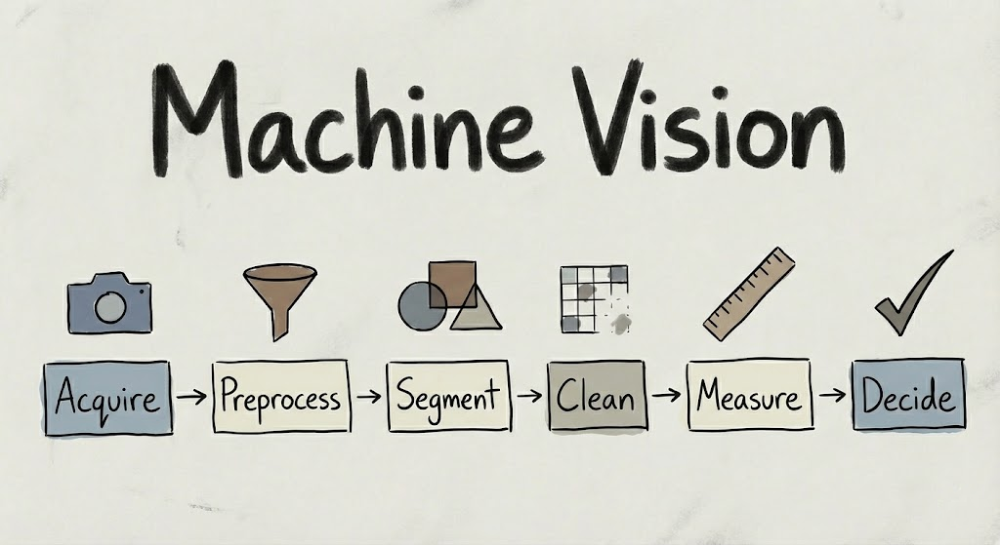

# Machine Vision with MATLAB: A Master’s-Level Course

This repository contains lecture slides and laboratory activity sheets from a **Master’s-level Machine Vision course** delivered in **Fall 2025** at **Sheffield Hallam University**.

**Delivered and led by:** **Dr. Mostapha Kalami Heris**, Sheffield Hallam University – 
[LinkedIn](https://www.linkedin.com/in/smkalami) · [University profile](https://www.shu.ac.uk/about-us/our-people/staff-profiles/mostapha-kalami-heris)

The course treats machine vision as a **practical decision-making pipeline**, combining core image processing theory with hands-on experimentation in MATLAB. The emphasis is not only on understanding individual algorithms, but also on how different stages of a vision system interact to produce reliable measurements and decisions in real-world applications.

The material was developed for a **multidisciplinary cohort**, including students from engineering, computing, and related backgrounds. For that reason, the teaching approach prioritizes conceptual clarity, visual intuition, and systematic problem solving rather than narrow domain-specific assumptions. The content is also relevant to learners and educators interested in **computer vision**, especially where explainable, pipeline-based methods are important.

## What is Machine Vision

Machine vision focuses on building systems that turn images into **measurements** and **decisions**. Unlike general image editing or visualization, machine vision is goal-driven. Typical tasks include detecting objects, measuring dimensions, identifying defects, counting items, locating parts for robotic manipulation, or preparing images for reliable text and symbol recognition.

Machine vision sits at the intersection of sensing and computation. It combines image acquisition (cameras, optics, illumination), algorithmic processing (filtering, segmentation, morphology, and measurement), and decision-making logic. While modern vision systems often include learning-based components, this course emphasizes **foundational, explainable, and pipeline-driven methods** that remain essential in many industrial and applied systems.

Common application areas include:

- **Industrial inspection**: defect detection, presence or absence checks, and dimensional measurement
- **Robotics and automation**: localization, tracking, and vision-guided manipulation
- **Food and agriculture**: quality grading, sorting, and contamination detection
- **Healthcare and microscopy**: cell counting, region delineation, and assisted analysis
- **Document processing and OCR**: binarization, cleanup, and recognition pre-processing
- **Transportation and safety**: feature detection, monitoring, and tracking

## Teaching Approach

The module is taught as a **connected set of ideas** rather than a collection of isolated techniques. The central organizing concept is the **machine vision pipeline**, which provides a systematic way to think about real vision systems:

**Acquire → Preprocess → Segment → Clean (Morphology) → Measure → Decide**

Students learn how decisions made early in the pipeline, such as choices related to illumination, noise reduction, or contrast enhancement, can strongly influence downstream segmentation quality, measurement reliability, and final system performance. This pipeline perspective helps students move beyond trial-and-error and develop structured reasoning about vision problems.

Laboratory sessions are designed as **guided exploratory activities** rather than fixed recipes. Students are encouraged to experiment with parameters, compare alternative methods, observe failure cases, and reflect on trade-offs. The emphasis is on understanding *why* an approach works or fails, not just *how* to implement it.

This approach is particularly suitable for multidisciplinary cohorts, as it supports learners with different technical backgrounds while still developing a rigorous and transferable way of thinking about machine vision and computer vision systems.

## What You Will Learn

By working through the lectures and laboratory activities in this repository, learners will develop the ability to:

- Understand images as numerical data and work confidently with different image representations and formats
- Analyze and improve image contrast using global and local enhancement techniques
- Design and apply linear and nonlinear spatial filters for smoothing, sharpening, and edge detection
- Reason about noise, robustness, and boundary effects in real image data
- Segment images into meaningful regions using thresholding and adaptive methods
- Use morphological operations to clean segmentation results and refine object shapes
- Build complete machine vision pipelines that connect preprocessing, segmentation, morphology, and measurement
- Extract measurements and features from images to support decision-oriented applications
- Translate theoretical concepts into practical MATLAB implementations

These skills are directly applicable to industrial inspection, robotics, food and agricultural imaging, document processing, and other applied machine vision domains.

## Industry and Real-World Exposure (AFIC Visit)

As part of the module delivery, a guided visit was arranged for students to the **[Advanced Food Innovation Centre (AFIC)](https://www.shu.ac.uk/advanced-food-innovation-centre)** at Sheffield Hallam University, a research center focused on problem-led innovation and applied research in sustainable and healthier food systems.

AFIC is a research center focused on problem-led research, innovation, and knowledge exchange in sustainable and healthier food systems. The purpose of this visit was to help students connect lecture and laboratory concepts to **real-world machine vision applications in the food industry**, where imaging conditions and constraints are often far from ideal.

During the visit, students were introduced to practical challenges commonly encountered in industrial vision systems, including:

- **Uneven illumination**, reflections, and shadows caused by packaging and surface properties
- **Irregular shapes and textures**, which complicate segmentation and measurement
- **Speed, robustness, and reliability constraints**, where decisions must be consistent and repeatable
- **Quality inspection requirements**, including grading, defect detection, and compliance checks

The visit reinforced key ideas from the module, particularly the importance of careful preprocessing, robust segmentation, and well-designed pipelines. It also highlighted why explainable, pipeline-based machine vision and image processing methods remain highly relevant in industrial and applied research settings.

Readers are encouraged to follow the material sequentially, pairing each lecture with its corresponding laboratory activity to reinforce concepts through hands-on experimentation.

## Core Module Structure: Topics, Lectures, and Laboratory Activities

The table below presents the **core structure of the Machine Vision module**, showing how topics progress over the semester and how each lecture is paired with a corresponding laboratory activity.

Rather than treating lectures and labs as separate components, the module is designed so that **theoretical concepts introduced in lectures are explored, tested, and reinforced through hands-on laboratory work**. This structure reflects how machine vision systems are developed in practice, where understanding emerges through the interaction between theory, experimentation, and observation.

The sequence moves from fundamental image representation and enhancement, through filtering and segmentation, toward complete machine vision pipelines and measurement-based decision making.

| Week | Topic | Lecture Material | Laboratory Activity |
|----:|-------|------------------|---------------------|
| 1 | Introduction to machine vision, images as data, and MATLAB foundations | [Lecture 01: Introduction](lectures/mv-lecture-01-introduction.pdf) | [Lab 01: Image Representation and I/O in MATLAB](labs/mv-lab-01-image-representation-and-io-matlab.pdf) |
| 2 | Contrast enhancement, intensity transforms, and histogram interpretation | [Lecture 02: Contrast Enhancement and Histograms](lectures/mv-lecture-02-contrast-enhancement-and-histograms.pdf) | [Lab 02: Contrast Enhancement in MATLAB](labs/mv-lab-02-contrast-enhancement-matlab.pdf) |
| 3 | Spatial filtering fundamentals, kernels, and convolution intuition | [Lecture 03: Spatial Filtering](lectures/mv-lecture-03-spatial-filtering.pdf) | [Lab 03–04: Linear and Nonlinear Spatial Filtering](labs/mv-lab-03-04-linear-and-nonlinear-spatial-filtering.pdf) |
| 4 | Nonlinear filtering, robustness, and boundary effects | [Lecture 04: Nonlinear Filters](lectures/mv-lecture-04-nonlinear-filters.pdf) | [Lab 03–04: Linear and Nonlinear Spatial Filtering](labs/mv-lab-03-04-linear-and-nonlinear-spatial-filtering.pdf) |
| 5 | Image segmentation and thresholding methods | [Lecture 05: Image Segmentation and Thresholding](lectures/mv-lecture-05-image-segmentation-and-thresholding.pdf) | [Lab 05: Image Segmentation and Thresholding](labs/mv-lab-05-image-segmentation-and-thresholding.pdf) |
| 6 | Morphological operations for image cleaning and refinement | [Lecture 06: Morphological Operations and Cleaning](lectures/mv-lecture-06-morphological-operations-and-cleaning.pdf) | [Lab 06: Morphological Operations and Cleaning](labs/mv-lab-06-morphological-operations-and-cleaning.pdf) |
| 7 | Machine vision pipelines and end-to-end application workflows | [Lecture 07: Machine Vision Pipeline](lectures/mv-lecture-07-machine-vision-pipeline.pdf) | [Lab 07: Machine Vision Pipeline](labs/mv-lab-07-machine-vision-pipeline.pdf) |
| 8 | Frequency domain techniques and spectral interpretation | Coming soon | [Lab 08: Frequency-Domain Methods](labs/mv-lab-08-frequency-domain-methods.pdf) |
| 9 | Feature extraction, measurement, and decision-oriented analysis | Coming soon | [Lab 09: Measurement and Feature Extraction](labs/mv-lab-09-measurement-and-feature-extraction.pdf) |

## Session Summaries: Learning Focus by Week

The brief summaries below highlight the **main learning focus of each week**, showing how concepts build progressively from image fundamentals to full machine vision pipelines and measurement-driven analysis.

- **Week 1: Foundations of Machine Vision**
  Introduction to machine vision as a decision-oriented discipline. Images are treated as numerical data, with emphasis on safe image input, representation, and visualization in MATLAB.

- **Week 2: Contrast and Intensity Interpretation**
  Exploration of contrast enhancement techniques and histogram-based reasoning. Students learn how intensity distributions affect visibility, segmentation, and downstream processing.

- **Week 3: Spatial Filtering and Linear Operators**
  Core ideas of spatial filtering are introduced, including convolution, correlation, kernel interpretation, and the qualitative behavior of common linear filters.

- **Week 4: Nonlinear Filtering and Robustness**
  Nonlinear filters are studied as tools for robustness, particularly under noise and outliers. Boundary effects and practical filter design choices are discussed.

- **Week 5: Segmentation as a Decision Step**
  Thresholding and segmentation are examined as critical transitions from images to regions. Students explore global and adaptive methods and analyze failure cases.

- **Week 6: Morphology and Structural Refinement**
  Morphological operations are introduced as shape-based tools for cleaning segmentation results, separating objects, and correcting structural defects.

- **Week 7: Machine Vision Pipelines**
  The full machine vision pipeline is assembled and analyzed. Students learn how preprocessing, segmentation, morphology, and measurement interact in end-to-end workflows.

- **Week 8: Frequency-Domain Thinking**
  Images are interpreted in the frequency domain. Spectral representations and filtering concepts are introduced to complement spatial-domain intuition. *(Lecture material coming soon.)*

- **Week 9: Measurement and Feature-Based Analysis**
  Segmented regions are transformed into numerical descriptors. Students explore measurement reliability, feature extraction, and how vision systems support decisions. *(Lecture material coming soon.)*

Each laboratory activity is tightly aligned with the corresponding lecture content. Rather than providing step-by-step solutions, the labs are designed to encourage exploration, comparison of methods, and critical evaluation of results.

Students are expected to:
- Modify parameters and observe their effects
- Compare alternative techniques for the same task
- Analyze failure cases and limitations
- Reflect on how individual steps affect the overall vision pipeline

This structure mirrors real machine vision development, where iterative testing and refinement are essential.

## Educational Use and Boundaries

This repository is shared for **educational and self-study purposes**.

- It does **not** include assessment solutions, marking schemes, or official coursework submissions.
- Laboratory activity sheets are designed as **learning exercises and starting points for exploration**, not as final or authoritative answers.
- Users are encouraged to adapt the material responsibly and in accordance with their own institutional academic integrity policies.

The aim of sharing this material is to support learning, teaching, and knowledge exchange in machine vision, image processing, and computer vision, while preserving academic integrity.

## About the Instructor

**Dr. Mostapha Kalami Heris, BSc, MSc, PhD**
Assistant Professor (Lecturer) in Control Engineering and Intelligent Systems
School of Engineering and Built Environment
College of Business, Technology and Engineering
Sheffield Hallam University

- [LinkedIn profile](https://www.linkedin.com/in/smkalami)
- [University profile](https://www.shu.ac.uk/about-us/our-people/staff-profiles/mostapha-kalami-heris)
- Academic Email: m.k.heris@shu.ac.uk

## License and Attribution

This repository is licensed under the **Creative Commons Attribution–NonCommercial 4.0 International (CC BY-NC 4.0)** license.

You are free to use, share, and adapt the material for **non-commercial educational purposes**, provided appropriate credit is given.

**Any commercial use requires explicit permission from the author.**

For full license details, see the [LICENSE](LICENSE) file in this repository.

### Attribution

If you use or adapt this material for teaching, learning, or curriculum development, please provide appropriate attribution and include a link back to this repository.

